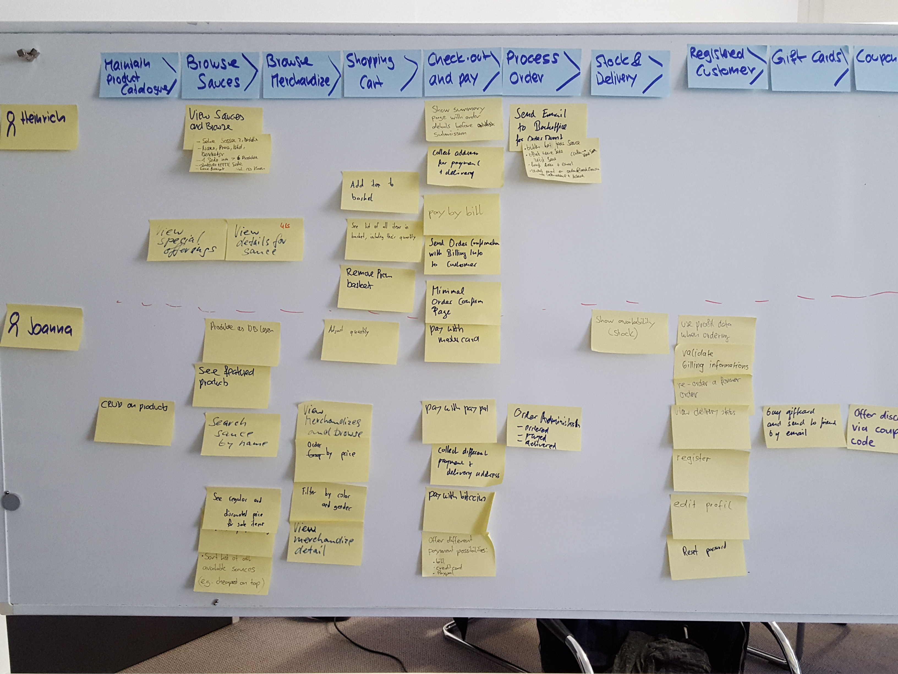

# My System Docu

The directory `docs` is a place where the generator can store any documents in arbitrary project specific file structure. 

This directory can contain resources like:
* Markup Documentation for the features (md, html, txt files)
* Executable Specification files (feature, java, js, ts, cs, ...)
* Images (embedded in the markdown files)
* any other project documents that we might want to embed later
    
## Sub Chapter 1

Markdown files can have sub chapter
    
## Another Sub Chapter

We can even have links inside the same file: [Sub Chapter 1](#sub-chapter-1)   

Or also links to other files [Chapter in Other Docu File](feature-area-1/README.md#chapter-2)

## Embedded Images

Markdown files can contain images from the docs directory (usually relative pathes, or absolute to the docs directory)

## TODO

Documents in this folder are not yet cleaned up, there is a mess, but this can be generally structured in whatever way the project structrues these documents and thus not have to reflect the feature structure in the feature folders.

