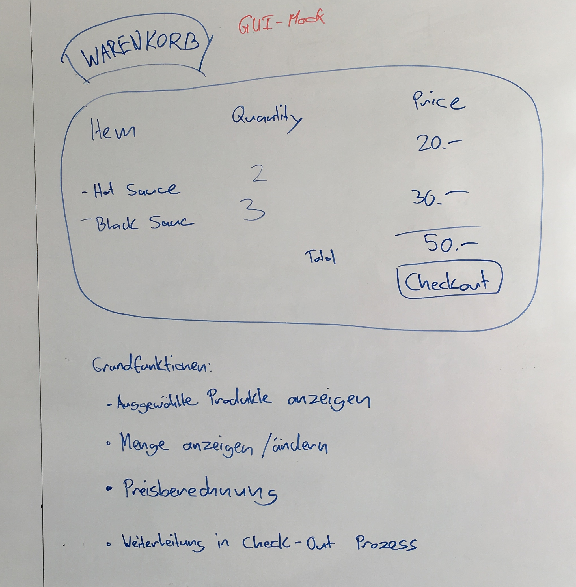

# Shopping cart

## GUI Mock


GUI Mock from the worshop of 05.04.2016
Shopping cart
=============

Releated items
--------------
JIRA epic: [ZTOPSBE-10](https://jira.zuehlke.com/browse/ZTOPSBE-10)

RE workshop (05.04.2016)
------------------------

Step 1: Brainstorming about the vision of the blueprint


Step 2: First overview (draft) of the architecture


Step 3: Collection requirements for first user story "Show selected products"



Step 4: 3 Amigo Workshop on "Show selected products"


Specs
-----
* [Show selected products](specs/ShowSelectedProducts.feature)
* [Show shopping cart in different currencies](specs/ShowShoppingCartInDifferentCurrencies.feature)
* [Change amount of items](specs/ChangeAmountOfItems.feature)
* [Proceed to checkout process](specs/ProceedToCheckoutProcess.feature)
## Features
### [Show selected products](01_ShowSelectedProducts.feature)
```gherkin
@ZTOPSBE_10 @ZTOPSBE_16
Feature: Show selected products
	In order to verify my selection before I process the order
	As a customer
	I want see all my selected items and correct prices

	Todo: 
	 - What happens when a sauce is out of stock?
	 - NrOfItems max? Overflow?
	 - Round prices?
	 - Can a price be 0? Or negative?
	 - Is total price shown when no item is selected?
	 - Would it be useful to have separate example with roundings?

Scenario: Shopping cart with selected products
	Given I select the following products in the catalog:
	| ProductId | ProductName | PricePerItem | NrOfItems |
	| 123456    | Sauce X     | 9.99 CHF     | 2         |
	| 654321    | Sauce Y     | 14.98 CHF    | 3         |
	When I open my shopping cart
	Then the shopping cart shows the following details:
	| ProductId | ProductName | NrOfItems | PricePerPosition |
	| 123456    | Sauce X     | 2         | 19.98 CHF        |
	| 654321    | Sauce Y     | 3         | 44.94 CHF        |
	And the shopping cart shows the following totals:
	| TotalNrOfItems | TotalPrice |
	| 5              | 64.92 CHF  |

Scenario: Empty shopping cart
	Given No product has been selected
	When I open my shopping cart
	Then the shopping cart details is empty
	And the shopping cart shows the following totals:
	| TotalNrOfItems | TotalPrice |
	| 0              | 0.00 CHF   |


```

#### JIRA Tickets
- [ZTOPSBE-10](https://jira.zuehlke.com/secure/RapidBoard.jspa?rapidView=142&view=planning&selectedIssue=ZTOPSBE-10&epics=visible)
- [ZTOPSBE-16](https://jira.zuehlke.com/secure/RapidBoard.jspa?rapidView=142&view=planning&selectedIssue=ZTOPSBE-16&epics=visible)

### [Show shopping cart in different currencies](02_ShowShoppingCartInDifferentCurrencies.feature)
```gherkin
@ZTOPSBE_10 @ZTOPSBE_17 
@currency
Feature: Show shopping cart in different currencies
	In order to now how much money I have to spend
	As a customer
	I want see all the prices of my selected items in my currency

	Todo: 
	 - Can user change currency? When products already selected?
	 - Is it more readable when price and currency are in separated columns?

Scenario Outline: Shopping cart with currency
	Given I select the following products in the catalog:
	| ProductId | ProductName | PricePerItem     | NrOfItems |
	| 123456    | Sauce X     | 10.00 <Currency> | 2         |
	| 654321    | Sauce Y     | 15.00 <Currency> | 3         |
	When I open my shopping cart
	Then the shopping cart shows the following details:
	| ProductId | ProductName | NrOfItems | PricePerPosition |
	| 123456    | Sauce X     | 2         | 20.00 <Currency> |
	| 654321    | Sauce Y     | 3         | 45.00 <Currency> |
	And the shopping cart shows the following totals:
	| TotalNrOfItems | TotalPrice       |
	| 5              | 65.00 <Currency> |

Examples:
| Scenario    | Currency |
| Switzerland | CHF      |
| EU          | EUR      |
| US          | USD      |


```

#### JIRA Tickets
- [ZTOPSBE-10](https://jira.zuehlke.com/secure/RapidBoard.jspa?rapidView=142&view=planning&selectedIssue=ZTOPSBE-10&epics=visible)
- [ZTOPSBE-17](https://jira.zuehlke.com/secure/RapidBoard.jspa?rapidView=142&view=planning&selectedIssue=ZTOPSBE-17&epics=visible)

### [Change amount of items](03_ChangeAmountOfItems.feature)
```gherkin
@ZTOPSBE_10 @ZTOPSBE_19
Feature: Change amount of items
	In order to change my order
	As a customer
	I want to be able to correct the amount of a selected product

	Todo:
		- Cases with +/- buttons?

Scenario: Increase the number of the first product
	Given the shopping cart shows the following details:
	| ProductId | ProductName | NrOfItems | PricePerPosition |
	| 123456    | Sauce X     | 2         | 10.00 CHF        |
	| 654321    | Sauce Y     | 3         | 15.00 CHF        |
	When I change number of items of "Sauce X" to 4
	Then the shopping cart shows the following details:
	| ProductId | ProductName | NrOfItems | PricePerPosition |
	| 123456    | Sauce X     | 4         | 40.00 CHF        |
	| 654321    | Sauce Y     | 3         | 45.00 CHF        |
	And the shopping cart shows the following totals:
	| TotalNrOfItems | TotalPrice |
	| 7              | 85.00 CHF  |

Scenario: Decrease the number of the second product
	Given the shopping cart shows the following details:
	| ProductId | ProductName | NrOfItems | PricePerPosition |
	| 123456    | Sauce X     | 2         | 10.00 CHF        |
	| 654321    | Sauce Y     | 3         | 15.00 CHF        |
	When I change number of items of "Sauce Y" to 1
	Then the shopping cart shows the following details:
	| ProductId | ProductName | NrOfItems | PricePerPosition |
	| 123456    | Sauce X     | 2         | 20.00 CHF        |
	| 654321    | Sauce Y     | 1         | 15.00 CHF        |
	And the shopping cart shows the following totals:
	| TotalNrOfItems | TotalPrice |
	| 3              | 35.00 CHF  |


```

#### JIRA Tickets
- [ZTOPSBE-10](https://jira.zuehlke.com/secure/RapidBoard.jspa?rapidView=142&view=planning&selectedIssue=ZTOPSBE-10&epics=visible)
- [ZTOPSBE-19](https://jira.zuehlke.com/secure/RapidBoard.jspa?rapidView=142&view=planning&selectedIssue=ZTOPSBE-19&epics=visible)

### [Proceed to checkout process](04_ProceedToCheckoutProcess.feature)
```gherkin
@ZTOPSBE_10 @ZTOPSBE_18
Feature: Proceed to checkout process
	In order to order my selected products
	As a customer
	I want to proceed and move to the checkout process

Scenario: At least one product is selected
	Given I select the following products in the catalog:
	| ProductId | ProductName | PricePerItem | NrOfItems |
	| 123456    | Sauce X     | 9.99 CHF     | 1         |
	When I open my shopping cart
	Then the checkout function is available

Scenario: No product has been selected
	Given No product has been selected
	When I open my shopping cart
	Then the checkout function not available

Scenario: Proceed to checkout process
	Given the shopping cart shows the following details:
	| ProductId | ProductName | NrOfItems | PricePerPosition |
	| 123456    | Sauce X     | 2         | 19.98 CHF        |
	When select the checkout function
	Then the checkout page is shown


```

#### JIRA Tickets
- [ZTOPSBE-10](https://jira.zuehlke.com/secure/RapidBoard.jspa?rapidView=142&view=planning&selectedIssue=ZTOPSBE-10&epics=visible)
- [ZTOPSBE-18](https://jira.zuehlke.com/secure/RapidBoard.jspa?rapidView=142&view=planning&selectedIssue=ZTOPSBE-18&epics=visible)

## Sub Features
### [re-workshops](re-workshops)
#### [2016- 04- 05](re-workshops\2016-04-05)

### [stories](stories)
#### [show-selected-products](stories\show-selected-products)


  