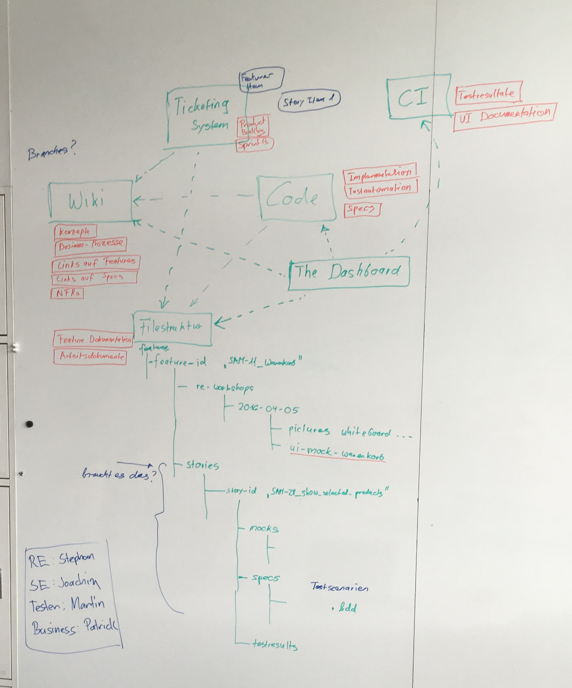
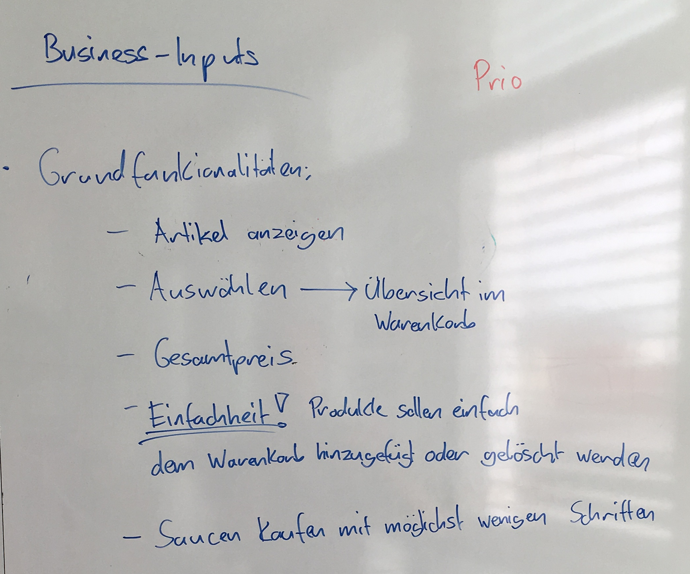
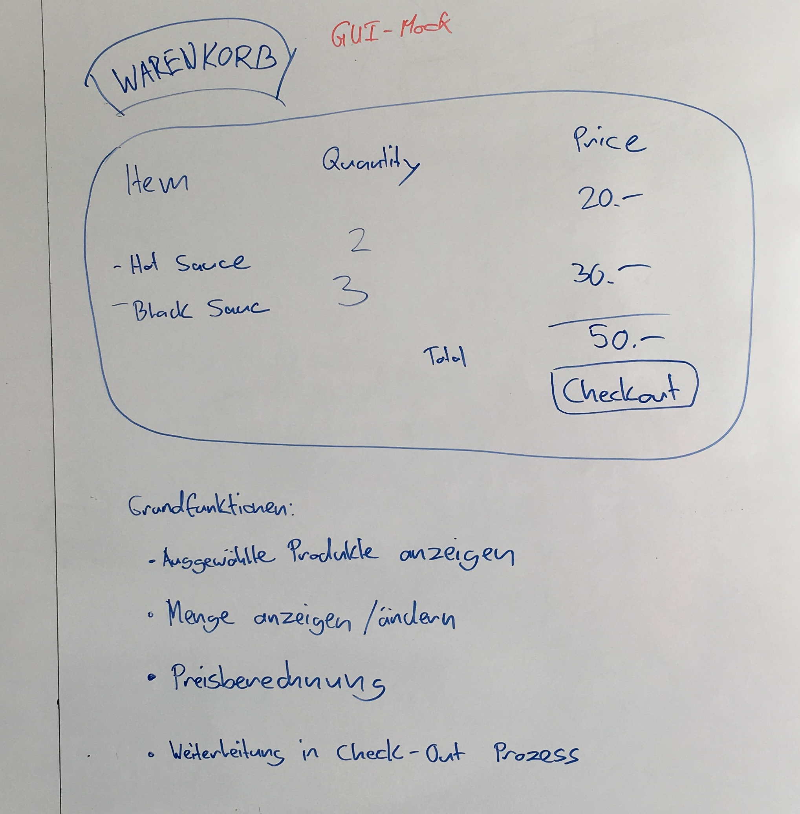

Shopping cart
=============

Releated items
--------------
JIRA epic: [ZTOPSBE-10](https://jira.zuehlke.com/browse/ZTOPSBE-10)

RE workshop (05.04.2016)
------------------------

Step 1: Brainstorming about the vision of the blueprint

Step 2: First overview (draft) of the architecture

Step 3: Collection requirements for first user story "Show selected products"

Step 4: 3 Amigo Workshop on "Show selected products"

Specs
-----
* [Show selected products](specs/ShowSelectedProducts.feature)
* [Show shopping cart in different currencies](specs/ShowShoppingCartInDifferentCurrencies.feature)
* [Change amount of items](specs/ChangeAmountOfItems.feature)
* [Proceed to checkout process](specs/ProceedToCheckoutProcess.feature)